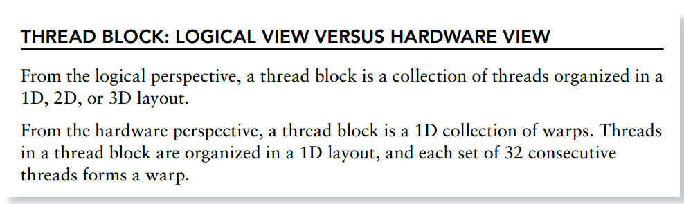
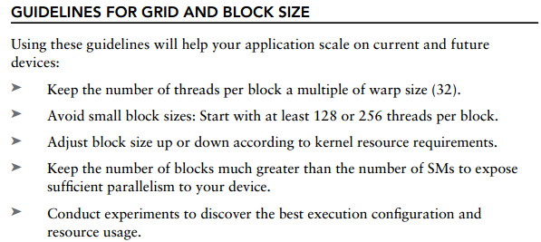

8_Understanding_the_nature_of_WARP
==================================================
Launching kernel时,从软件角度看,所有的线程是并行的. 

但从硬件角度来讲,并不是所有的线程同时执行. 

cuda中,将32个线程分到一个单元,该单元称为warp.

warp数计算
------------------

分配的warp数 = 1个Block的threads总数 / warpSize , 然后向上取整,

即 分配的warp数 = ceil(1个Block的threads总数 / warpSize) 

如果现在有80个线程,则会分配3个warp,即96个线程来支持80个线程,尽管这些线程没有用,但是仍然会消耗SM资源,比如说寄存器.

warp Divergence
------------------------

一个warp中的32个threads需要执行相同的指令,但是如果32个线程中遇到控制流语句时,如果进入不同的分支,那么同一时刻除了正在执行的分支外,其余分支被阻塞了,会影响性能.这类问题就是warp divergence.
比如在一个warp中程序如下:

if(cond)
{}
else
{}

如果有16个thread的cond为True,则这16个线程执行,同时其余16个线程被暂停.等这16个线程执行完之后,再执行其余16个线程.因此就会导致性能减半. 

为了获得最好的性能,需要避免同一个warp存在不同的执行路径.

如何避免warp divergence
-----------------------------

将条件改为以warp大小为步调,然后取奇偶数,

if((cond/warpSize) % 2)
{}
else 
{}

用nvprof来分析branch的效率,可以用来检查是否有可以提高的必要性.

:: 

 nvprof --metrics branch_efficiency ./simpleDivergence

nvcc -g -G 编译时不做branch 的优化
nvcc -O3 编译时会做branch的优化

资源分配
----------------------------------
计算资源限制了有效的warp数,因此,必须要注意硬件的限制,为最大化gpu的利用率,你需要最大化有效warps的数量.

compute resource partitioning requires special attention in CUDA programming: The compute resources limit the number of active warps. Therefore, you must be aware of the restrictions imposed by the hardware, and the resources used by your kernel. In order to maximize GPU utilization, you need to maximize the number of active warps.

一个thread block被成为active block当计算资源如寄存器,共享内存分配给该block.它所包含的warp就被成为active warps.active warps进一步会被分为三类:

- selected warp

- stalled warp

- eligible warp

分配grid,block size 指南
-----------------------------

